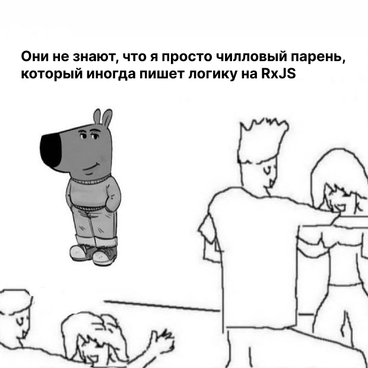

 
  

  # Обо мне

  <v-clicks>

  - 6 лет во фронтенде, больше 3-х лет работаю над realtime- и WebRTC-проектах
  - В прошлом — разработчик WebSDK для WebRTC-платформы Voximplant
  - Сейчас — в команде видеоконференций Jazz
  - Выступал на предыдущем Холи с докладом про [захват медиа в WebRTC-приложениях](https://holyjs.ru/archive/2024%20Autumn/talks/7a73217c51984396b666b9c8d4df4a00)

  </v-clicks>

  

  

    <ImageFrame class="max-h-120">
      
    </ImageFrame>
  

---
layout: two-cols
class: absolute-vclick
---

# Асинхронная природа   WebRTC-приложения

<v-clicks>

- Захват медиа
- Воспроизведение медиа
- WebSocket
- WebRTC-соединение

</v-clicks>

::right::

<SlidevVideo v-click="1" autoplay muted loop>
  <source src="../assets/demo-jazz.mp4" />
</SlidevVideo>

<!--
TODO: Иллюстрации для каждого пункта
-->

---

# Почему не RxJS

<v-clicks>

1. Только для Angular-приложений
2. Нужно переписать весь проект
3. В моём фреймворке уже есть реактивность
4. Очень сложный
5. Супер старый

</v-clicks>

<ImageFrame v-click v-drag="[242,35,536,516]">
  
</ImageFrame>

<!--
Когда я слышал об RxJS, я даже его особо не рассматривал как инструмент, который я могу использовать в своих приложениях.

Много булетов
-->

---
title: Они не знают, что я просто чилловый парень
---

<ImageFrame>
  
</ImageFrame>

<!--
  И в этом докладе я хочу поделиться почти двухлетним опытом использования RxJS в проекте на Реакте. И моя мотивация в этом докладе рассказать про то, как можно интегрировать RxJS в приложении на других фреймворках.
-->
