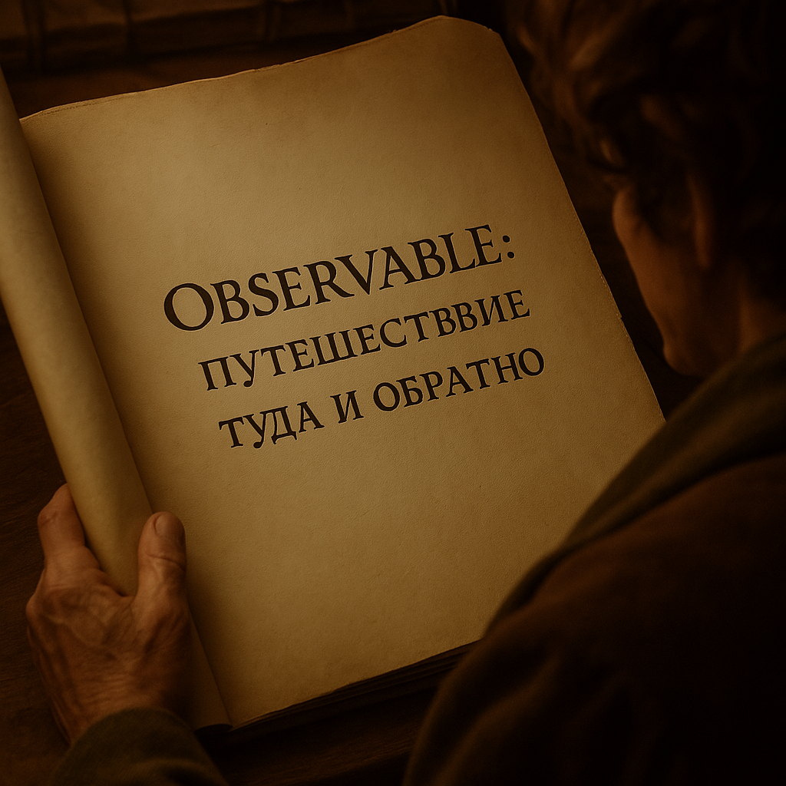

# RxJS и асинхронный JS

---
layout: two-cols-header
---

# Чем похож Observable

::left::

## События

<v-clicks> 

- Вызывается много раз
- Можно отписаться

</v-clicks>

::right::

## Промисы
<v-clicks>

- Есть возможности для композиции
- Конечен, если завершился

</v-clicks>

<!--
TODO: добавить марджинов для списков
-->

---
layout: two-cols-header
---

# addEventListener vs Observable

::left::

### addEventListener

```ts
const handler = () => {
  console.log('Clicked!')
};

document.addEventListener('click', handler);

// To unsubscribe:
document.removeEventListener('click', handler);
```

::right::

### Observable

```ts
import { fromEvent } from 'rxjs';

const documentClicks$ = fromEvent(document, 'click')

const subscription = documentClicks$.subscribe(() => {
  console.log('Clicked!')
});

// To unsubscribe:
subscription.unsubscribe();
```

---
layout: two-cols-header
class: absolute-vclick
---

# Promise vs Observable

::left::

### Promise

````md magic-move
```ts {*}{lines: true}
const timeout = new Promise((resolve) => {
  setTimeout(() => {
    resolve('Timeout!');
  }, 1000);
});

timeout.then((value) => console.log(value));
```

```ts {*|1|3|5|7|7|7|7}{lines: true, at: 5}
Promise.race([promise1, promise2]);

Promise.any([promise1, promise2]);

Promise.all([promise1, promise2]);

Promise.allSettled([promise1, promise2]);
```

```ts {*|5}{lines: true}
const bestConference = Promise.resolve('holy')

promise
 .then((value) => console.log(value))
 .catch((error) => console.error(error))
```
````

::right::

### Observable

````md magic-move {at: 1}
```ts {*}{lines: true}
const timer$ = timer(1000).pipe(
  map(() => 'Timeout!')
);

timer$.subscribe((value) => {
  console.log(value);
});
```

```ts {*|1|3-5|7|9-17|9-13|14-17|4,12}{lines: true, at: 5}
race([obs1, obs2]);

race([obs1, obs2]).pipe(
  catchError((err) => of(err)),
);

forkJoin([obs1, obs2]);

// map to { result: 'fulfilled' | 'rejected', value }
const mapToSettledResult = pipe(
  map((value) => ({ status: 'fulfilled', value })),
  catchError(err => of({ status: 'rejected', value: err }))
)
forkJoin([
  obs1.pipe(mapToSettledResult),
  obs2.pipe(mapToSettledResult)
]);

```

```ts {*|*}{lines: true}
const bestConference$ = of('HolyJS')

bestConference$.subscribe((value) => {
  console.log(value)
})
```
```ts {*|4|5|6}{lines: true}
const bestConference$ = of('HolyJS')

bestConference$.subscribe({
  next: (value) => console.log(value),
  error: (error) => console.error(error),
  complete: () => console.log('complete')
})
```
````

---
title: Observable туда и обратно
---

<ImageFrame>
  
</ImageFrame>

---
class: absolute-vclick
---

# Promise -> Observable{v-click.hide}
# Observable -> Promise{v-click="1"}

````md magic-move {at: 1}
```ts {*}{lines: true}
import { from } from 'rxjs';

const promise = Promise.resolve(42);
const observable = from(promise);

observable.subscribe((value) => {
  console.log(value) // Output: 42
}); 
```
```ts {*|4,7-9|5,10-12}{lines: true, at: 2}
import { of, firstValueFrom, lastValueFrom } from 'rxjs';

const observable = of(1, 2, 3);
const promiseFirst = firstValueFrom(observable);
const promiseLast = lastValueFrom(observable);

promiseFirst.then((value) => {
  console.log(value); // Output: 1
}); 
promiseLast.then(value => {
  console.log(value); // Output: 3
}); 
```
````

---
layout: center
disabled: true
---

# Promise -> Observable 
# Чем позже, тем лучше
