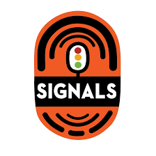
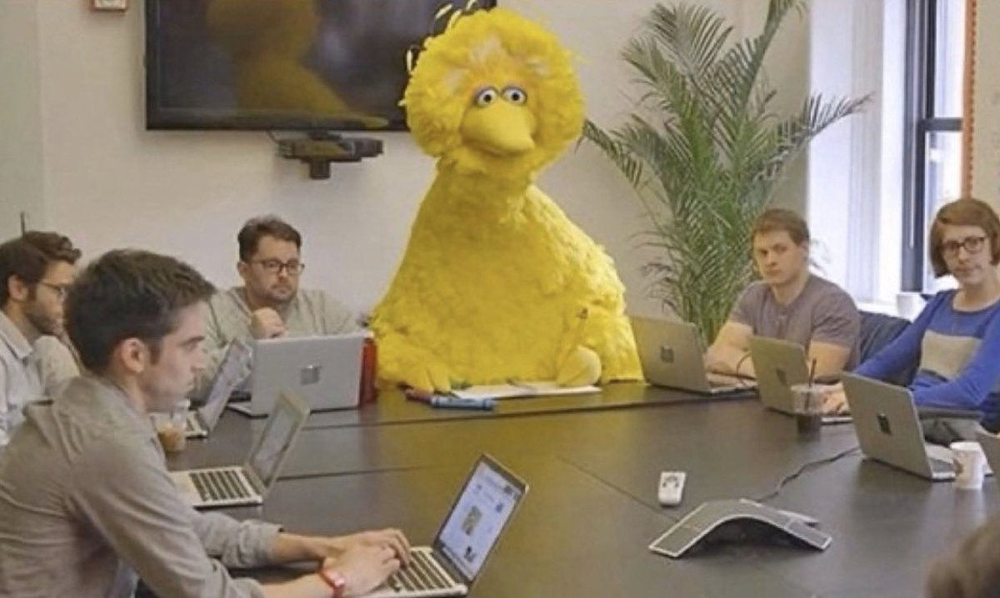
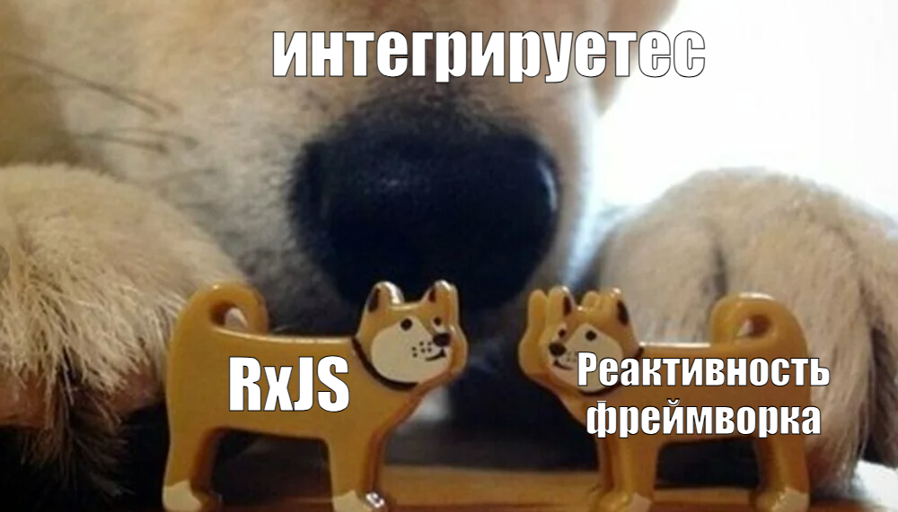

# RxJS и реактивность во фреймворках

---
layout: two-cols-header
---

# Сигналы 

::left::

<v-clicks>

- Минималистное API для выражения реактивной логики
- Есть множество реализаций во фреймворках
- [Есть пропосал в TC39](https://github.com/tc39/proposal-signals)
</v-clicks>

::right::

<ImageFrame>
  
</ImageFrame>

---

# Семантика сигналов

<!-- | Примитив             | React       | Vue                     | Angular    |
| -------------------- | ----------- | ----------------------- | ---------- |
| Состояние            | `useState`  | `ref`                   | `signal`   |
| Вычисляемое свойство | `useMemo`   | `computed`              | `computed` |
| Эффект               | `useEffect` | `watch` / `watchEffect` | `effect`   | -->

<table>
  <thead>
    <tr>
      <th>Примитив</th>
      <th>Vue</th>
      <th>Angular</th>
      <th>Svelte</th>
      <th>React*</th>
    </tr>
  </thead>
  <tbody>
    <tr>
      <td v-click="1">Состояние</td>
      <td v-click="1">ref</td>
      <td v-click="1">signal</td>
      <td v-click="1">state</td>
      <td v-click="1">useState*</td>
    </tr>
    <tr>
      <td v-click="2">Вычисляемое свойство</td>
      <td v-click="2">computed</td>
      <td v-click="2">computed</td>
      <td v-click="2">derived</td>
      <td v-click="2">useMemo*</td>
    </tr>
    <tr>
      <td v-click="3">Эффект</td>
      <td v-click="3">watch / watchEffect</td>
      <td v-click="3">effect</td>
      <td v-click="3">effect</td>
      <td v-click="3">useEffect*</td>
    </tr>
  </tbody>
</table>

---
title: Мем про реакт
---

<ImageFrame>
  
</ImageFrame>

---

# Что делают сигналы 

<v-clicks> 

- Мемоизируют
- Строят граф зависимостей
- Планируют обновления

</v-clicks>

<v-click at="1">

````md magic-move {at: 2}
```ts
const name = ref('Ben');

watchEffect(() => {
  // Эффект не вызовется второй раз
  console.log(`Hello ${name}!`) 
})

name.value = 'Ben'

```
```ts
const name = ref('Ben');
const surname = ref('Lesh');

const fullName = computed(() => {
  return `${name.value} ${surname.value}`
});

name.value = 'Evan'
surname.value = 'You'

fullName.value === 'Evan You'
```
```ts
const name = ref('Ben');
const surname = ref('Lesh');

watchEffect(() => {
  // Эффект вызовется один раз
  console.log(`${name.value} ${surname.value}`)
});

name.value = 'Evan'
surname.value = 'You'
```
````
</v-click>

<!--
TODO: придумать сценарий когда нужна последовательность событий, а не просто обновление стейта и показать как это решить на RxJS
TODO: придумать пример когда сигналы не вывозят
-->

---
disabled: true
---

# Мемоизация в RxJS

<v-switch>
  <template #1>
    <MarbleDiagram 
      ascii="--a--a--b--c-c--|" 
      :operators="[{ type: 'distinctUntilChanged', args: [], resultAscii: '--a-----b--c----|' }]"
      :width="600" 
      :height="200" 
      :labels="true" 
    />
  </template>
</v-switch>

---
layout: center
---

# Сигналы хорошо работают с состоянием, <br> а RxJS -- с событиями

---

<ImageFrame>
  
</ImageFrame>

---
layout: two-cols
class: absolute-vclick
---

# Vue 

## @vueuse/rxjs {v-click}

<v-click>

- `useObservable`
- `from`
- `toObserver`
- `useExtractedObservable`
- `useSubject`
- `useSubscription`
- `watchExtractedObservable`

</v-click>

::right::

# React

<div v-click="[3,4]">

## react-use

- `useObservable`

</div>

<div v-click="4">

## observable-hooks 

- `useObservable`
- `useLayoutObservable`
- `useObservableState`
- `useSubscription`
- `useLayoutSubscription`
- `useObservableCallback`
- `useObservableRef`
- `useObservableEagerState`
- `useLayoutObservableState`
- `useObservableGetState`
- `useObservablePickState`
- `useRenderThrow`

</div>

<!-- TODO: Добавить логотипы  -->