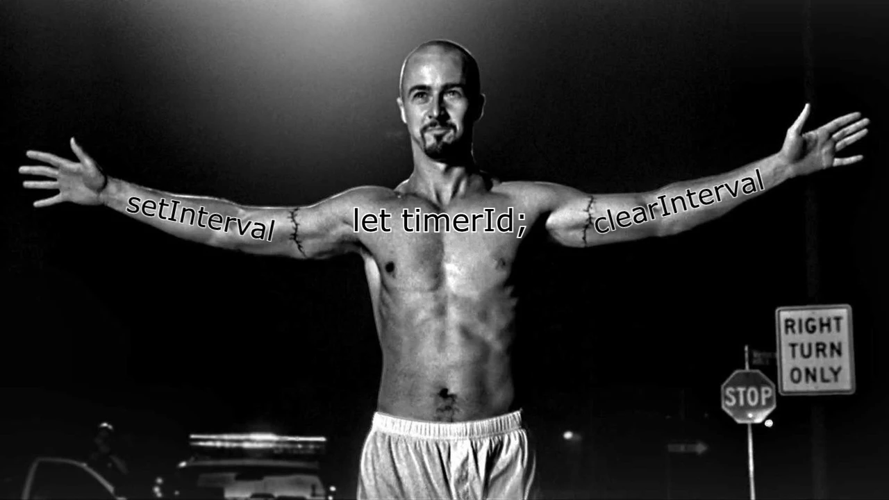

# RxJS и кейсы, которые он облегчает

---

# Таймеры

<v-clicks>

- Таймеры могут содержать много вложенной логики
- Императивное API

</v-clicks>


---
title: Мем чересчур императивное setTimeout АПИ
---

<ImageFrame>
  
</ImageFrame>

--- 
class: absolute-vclick
title: Демо с софтфоном
---

<div class="grid grid-cols-[350px_minmax(0,_1fr)] gap-x-20px"> 
  <v-switch unmount>
    <template #0>
      <Softphone :step="1" />
    </template>
    <template #2>
      <Softphone :step="2" />
    </template>
    <template #3>
      <Softphone :step="3" />
    </template>
    <template #4>
      <Softphone :step="4" />
    </template>
    <template #5>
      <Softphone :step="5" />
    </template>
    <template #6>
      <Softphone :step="6" />
    </template>
    <template #7>
      <Softphone :step="7" />
    </template>
    <template #8>
      <Softphone :step="8" />
    </template>
    <template #9>
      <Softphone :step="9" />
    </template>
    <template #10>
      <Softphone :step="10" />
    </template>
    <template #11>
      <Softphone :step="10" captureMedia />
    </template>
  </v-switch>

<v-click at="1">

````md magic-move {at: 2, lines: true}
<<< @/components/Softphone.vue#step-1 ts {*}
<<< @/components/Softphone.vue#step-2 ts {1,2,5-6}
<<< @/components/Softphone.vue#step-3 ts {1,5}
<<< @/components/Softphone.vue#step-4 ts {1,2,5-8}
<<< @/components/Softphone.vue#step-5 ts {1,8-11}
<<< @/components/Softphone.vue#step-6 ts {1,7-9,11-13}
<<< @/components/Softphone.vue#step-7 ts {1,14,16}
<<< @/components/Softphone.vue#step-8 ts {12}
<<< @/components/Softphone.vue#step-9 ts {5-11}
<<< @/components/Softphone.vue#step-10 ts {19|*}
<<< @/snippets/callDurationReact.ts#useObservable {*|4,22|9,20|*}
````

</v-click>
</div>


<style>
  .container {
  }

</style>
<!-- 
 TODO: Добавить диаграммы
 -->

---
layout: two-cols-header
class: absolute-vclick
---

# HTTP-клиенты

::left::

<v-clicks>

- Отменяемые запросы
- Таймауты
- Повторные запросы
- Маппинг в объекты с типом <br> `pending` | `success` | `failure`

</v-clicks>

::right::

````md magic-move {at: 1}
```ts
function createRequest(url: string) {
  return ajax.getJSON(url);
}
```
```ts
function createRequest(url$: Observable<string>) {
  return url$.pipe(
    switchMap(url => ajax.getJSON(url))
  );
}
```
```ts
function createRequest(url$: Observable<string>) {
  return url$.pipe(
    switchMap(url => ajax.getJSON(url).pipe(
      timeout(5000),
    ))
  );
}
```
```ts
function createRequest(url$: Observable<string>) {
  return url$.pipe(
    switchMap(url => ajax.getJSON(url).pipe(
      timeout(5000),
      retry(3)
    ))
  );
}
```
```ts
function createRequest(url$: Observable<string>) {
  return url$.pipe(
    switchMap(url => ajax.getJSON(url).pipe(
      timeout(5000),
      retry(3),
      map(data => ({ type: 'success', data }))
      catchError((error) => of({
        type: 'failure',
        error
      }))
      startWith({ type: 'pending' }),
    ))
  );
}
```
````

<style>
  .slidev-layout {
    @apply gap-x-0!; 
  }
</style>

---

# WebSocket 

```ts
import { webSocket } from 'rxjs/webSocket'

function createWebSocket(url$: Observable<string>) {
  return url$.pipe(
    switchMap(url => webSocket(url).pipe(
      timeout(5000),
      retry(3),
    ))
  );
}
```

<!--
TODO: Расписать преимущества вебсокета
TODO: Рассказать про холодный и горячий поток
-->